<div align="center">

# Le Salon de Lumière · Sistema de Reservas

### Plataforma web para la reserva de mesas y zonas de un restaurante, con panel administrativo, notificaciones por WhatsApp, auditoría y pruebas automatizadas

[](https://www.php.net/)
[](https://www.mysql.com/)
[](https://developer.mozilla.org/docs/Web/JavaScript)
[](https://getbootstrap.com/)
[](https://www.twilio.com/)
[](https://www.python.org/)

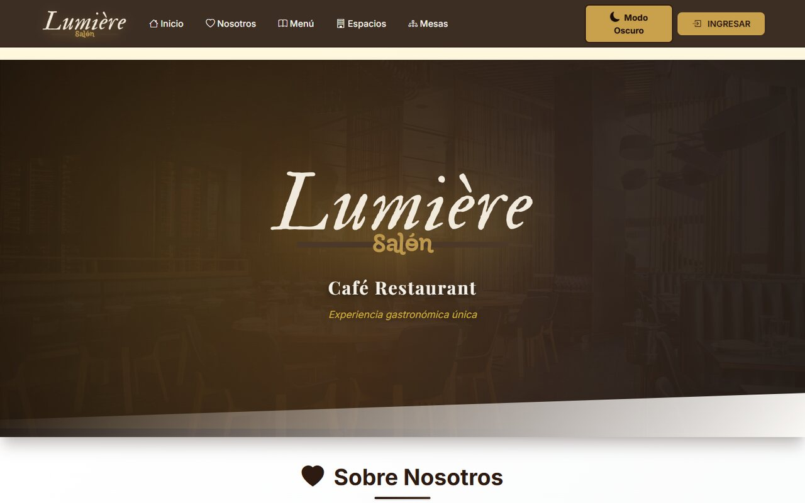

</div>

---

## Descripción

**Le Salon de Lumière** es un sistema completo de reservas para un restaurante. Los clientes consultan el menú, eligen mesa o zona según disponibilidad en tiempo real y gestionan sus reservas desde su perfil. El personal administrativo controla mesas, horarios, menú, clientes y configuración desde un panel centralizado, mientras el sistema notifica automáticamente a los clientes por **WhatsApp** y registra cada operación en tablas de **auditoría**.

El proyecto se desarrolló aplicando un proceso de software formal: arquitectura **MVC**, base de datos con **triggers** y procedimientos almacenados, **pruebas unitarias, de integración y de estrés**, y análisis de **métricas de calidad de código**.

## Capturas

<table>
  <tr>
    <td width="50%">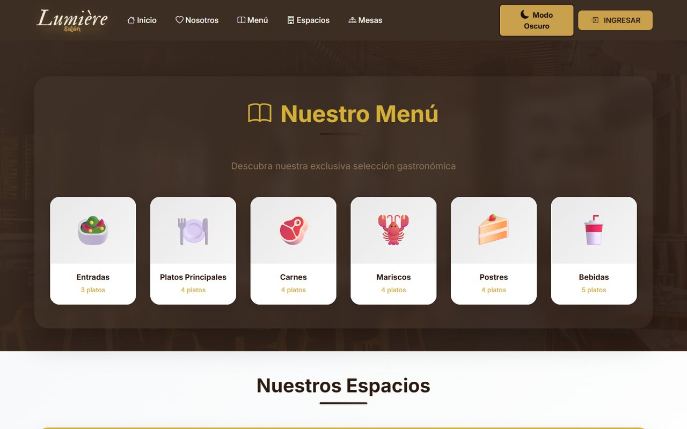</td>
    <td width="50%">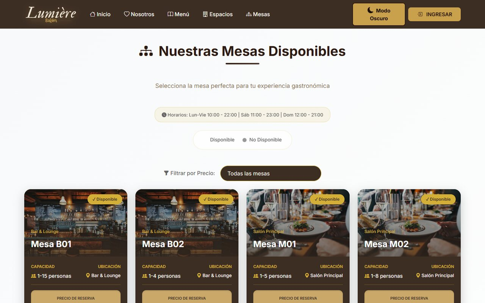</td>
  </tr>
  <tr>
    <td align="center"><sub>Menú del restaurante</sub></td>
    <td align="center"><sub>Disponibilidad de mesas</sub></td>
  </tr>
  <tr>
    <td width="50%">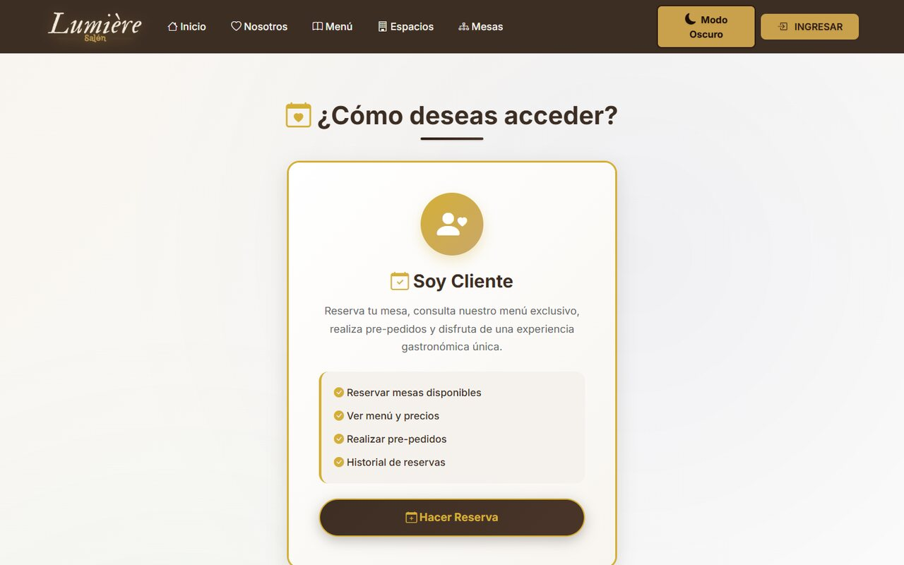</td>
    <td width="50%">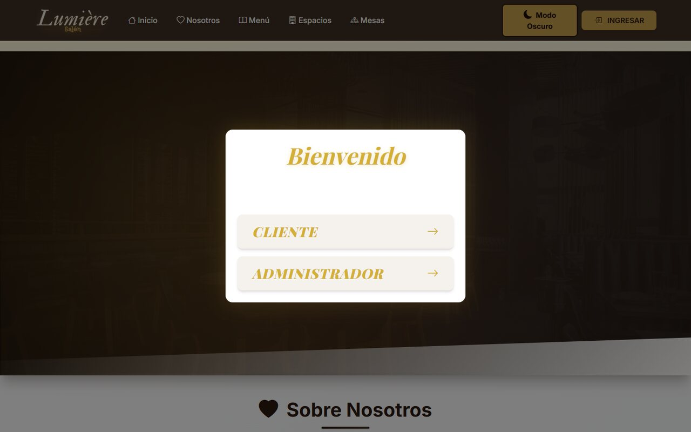</td>
  </tr>
  <tr>
    <td align="center"><sub>Reserva en línea</sub></td>
    <td align="center"><sub>Acceso por tipo de usuario</sub></td>
  </tr>
  <tr>
    <td width="50%">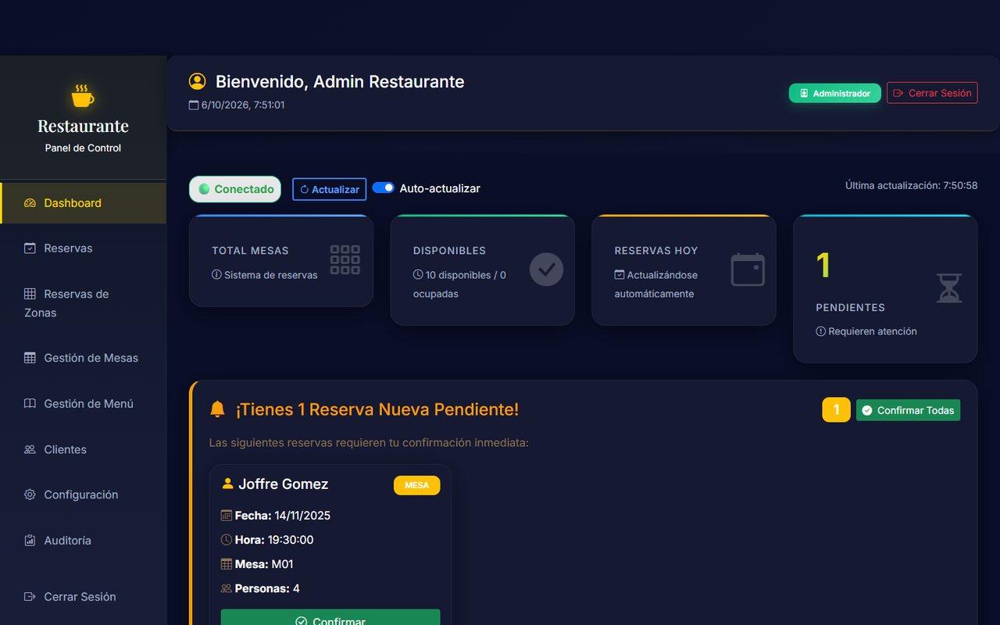</td>
    <td width="50%">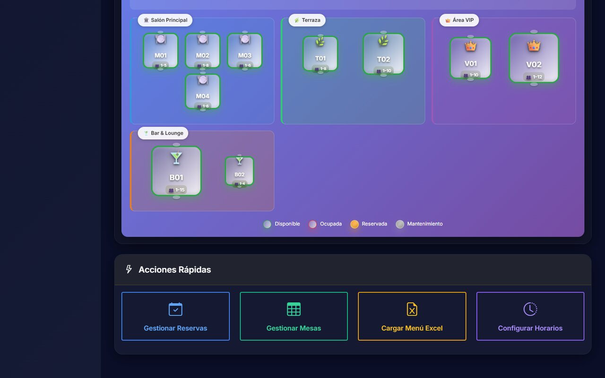</td>
  </tr>
  <tr>
    <td align="center"><sub>Panel administrativo</sub></td>
    <td align="center"><sub>Gestión de reservas</sub></td>
  </tr>
  <tr>
    <td width="50%">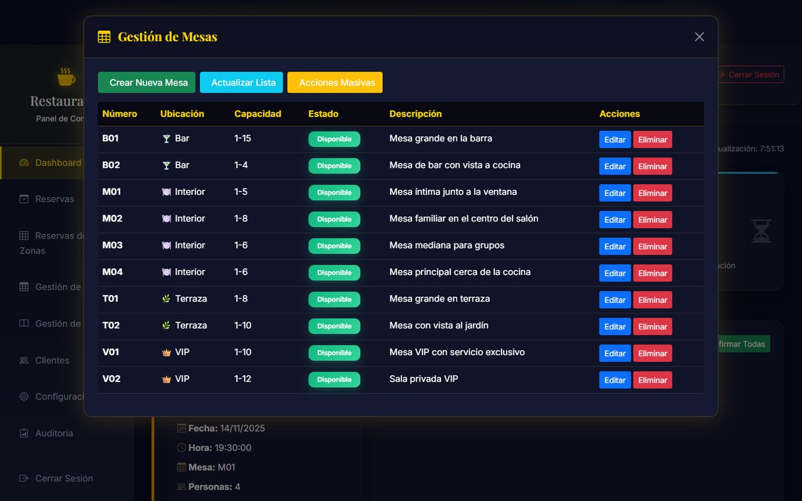</td>
    <td width="50%">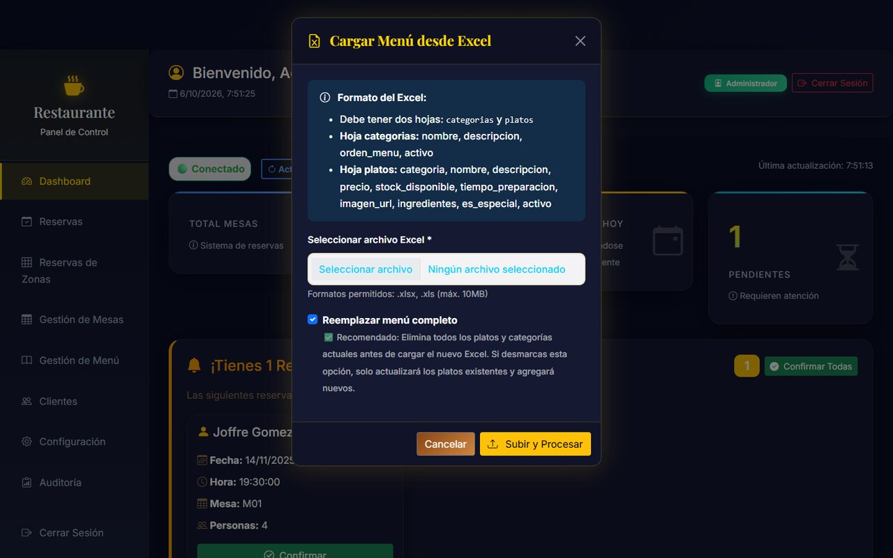</td>
  </tr>
  <tr>
    <td align="center"><sub>Gestión de mesas</sub></td>
    <td align="center"><sub>Carga masiva del menú desde Excel</sub></td>
  </tr>
</table>

## Funcionalidades

**Clientes**
- Registro e inicio de sesión con validación de datos (nombres, teléfono, correo).
- Consulta del menú por categorías y de los espacios del restaurante.
- Reserva de **mesas individuales** o de **zonas completas** con verificación de disponibilidad.
- Perfil con historial y estado de sus reservas.

**Administración**
- Dashboard con indicadores de ocupación y reservas.
- Gestión de mesas (capacidad, precio, estado) y de reservas: crear, editar, confirmar o cancelar con motivo.
- Configuración de **horarios de atención** con validación de conflictos frente a reservas existentes.
- Gestión del menú con **carga masiva desde Excel** (procesada con Python y Pandas).
- Gestión de clientes y configuración general del restaurante.

**Automatización y trazabilidad**
- **Notificaciones por WhatsApp** (API de Twilio) al confirmar, modificar o cancelar reservas, y cuando cambian los horarios.
- Actualización automática del estado de las reservas mediante procedimiento almacenado y tarea programada.
- **Triggers** que calculan el precio de las mesas y registran cada cambio de estado.
- **Auditoría** del sistema, de reservas y de horarios en tablas dedicadas.

## Arquitectura

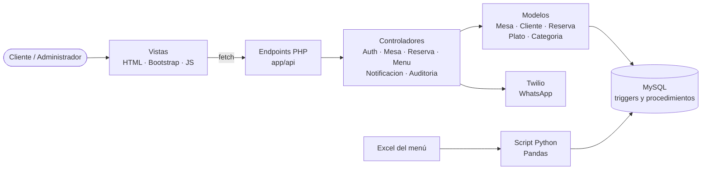

```
├── controllers/        Lógica de negocio (MVC)
├── models/             Acceso a datos con PDO
├── app/                Endpoints y APIs consumidas por el frontend
├── config/             Configuración, conexión Singleton y carga de variables de entorno
├── validacion/         Validadores del lado del servidor
├── sql/                Instalación completa, triggers, procedimientos y datos de prueba
├── scripts/            Tareas programadas y utilidades en Python
├── test-configuration/ Pruebas unitarias, de integración, de estrés y auditoría de tests
└── docs/               Documentación técnica y métricas de código
```

## Modelo de datos

15 tablas, entre ellas tres de auditoría.

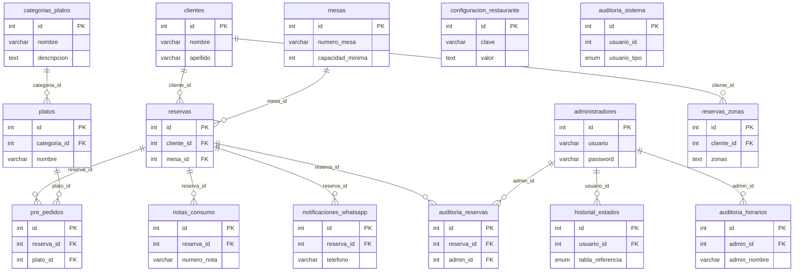

## Calidad y pruebas

- **Pruebas unitarias** por módulo (administración, clientes, login, registro, mesas, reservas y validadores).
- **Pruebas de integración** del CRUD de mesas y **pruebas de estrés** del panel administrativo.
- Reportes automáticos de ejecución y pistas de auditoría de cada corrida.
- Configuración de **PHPUnit** para pruebas de modelos, controladores y validadores.
- **Análisis estático propio** en Python: complejidad ciclomática, niveles de anidación, nomenclatura y adherencia a principios **SOLID** (`docs/metricas/`).

<div align="center">
  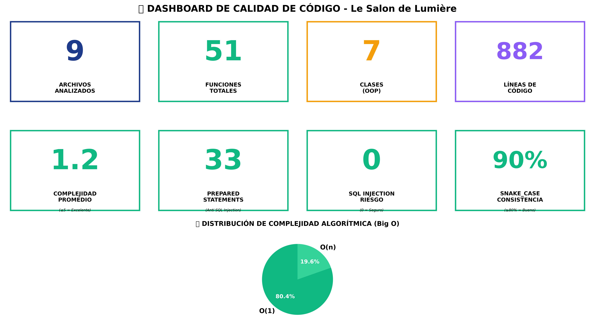
  <br><sub>Resumen del análisis de métricas de código</sub>
</div>

## Instalación

**Requisitos:** PHP 8+, MySQL 8 / MariaDB, Apache (XAMPP o LAMPP) y Python 3.10+ para los scripts y pruebas.

```bash
# 1. Clonar en htdocs
git clone https://github.com/Adrizzx/Sistema-Reservas-Restaurante.git

# 2. Crear la base de datos
mysql -u root -p < sql/INSTALACION_COMPLETA_BASE_DATOS.sql

# 3. Variables de entorno
cp .env.example .env              # credenciales de MySQL y Twilio (nunca se versiona)

# 4. Dependencias de Python (scripts y pruebas)
pip install -r scripts/python/requirements.txt
```

Guía detallada: [`docs/INSTRUCCIONES_INSTALACION.txt`](docs/INSTRUCCIONES_INSTALACION.txt) · Despliegue: [`DEPLOY_INSTRUCTIONS.md`](DEPLOY_INSTRUCTIONS.md)

## Equipo

Proyecto grupal de la asignatura **Modelos de Procesos de Software**, Universidad de las Fuerzas Armadas ESPE.

| Integrantes |
|---|
| **Marco Adrian Padilla Triviño** ([@Adrizzx](https://github.com/Adrizzx)) |
| Joffre Esteban Gómez Quinaluisa |
| Rubén Alejandro Bustos Viteri |
| Adonny Mateo Calero Argüello |
| Luciana Francheska Bolaños Toapanta |
| Daniela Flores |
| Evelyn Villarreal |
| Víctor Guano |
| Steven |
